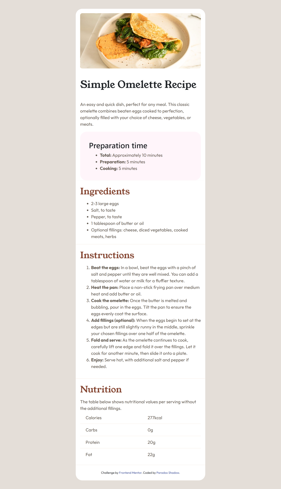

# Frontend Mentor - Recipe page solution

This is a solution to the [Recipe page challenge on Frontend Mentor](https://www.frontendmentor.io/challenges/recipe-page-KiTsR8QQKm). Frontend Mentor challenges help you improve your coding skills by building realistic projects. 

## Table of contents

- [Overview](#overview)
  - [The challenge](#the-challenge)
  - [Screenshot](#screenshot)
  - [Links](#links)
- [My process](#my-process)
  - [Built with](#built-with)
  - [What I learned](#what-i-learned)
  - [Continued development](#continued-development)
- [Author](#author)
- [Acknowledgments](#acknowledgments)


## Overview

### Screenshot



### Links

- Solution URL: [Add solution URL here]()
- Live Site URL: [Add live site URL here]()

## My process

### Built with

- Semantic HTML5 markup
- CSS custom properties
- Mobile-first workflow
- Bootstrap 5: for the grid and responsive design utilities


### What I learned
Sometimes you can really hung up on seemingly simple piece of code. This happened to me here. I was really confused regarding whether to add header section in this project or not. The reason being in the desktop design, 
it appears all the elements are children of a single parent container. So, I must have added and eliminated header section like three before finally decided on keeping it.
I was also facing issue in making the image equal to the width of the entire viewport on smaller screens. Forgot about the existence of vw unit. However, in the end I just went with the precentage. Just for a future reference if we a parent container with padding and want the image to span the entire viewport width. We can use 
  margin-left: calc((100% - 100vw) / 2); /* Centers the image without disrupting other layout elements */

```css
#nutrition-table tr:last-child {
   /* Used this for the first time */
}
```


### Continued development
Maybe I would continue to focus on learning how to write neat and clean code, avoid redundancies and try to do more with less.

## Author

- GitHub - [Taresta](https://github.com/Taresta/)
- Frontend Mentor - [Paradox](https://www.frontendmentor.io/profile/Taresta)


## Acknowledgments
I want to thank the person who believe in me. Even though I am do not know anything at all, but they still encourage me to keep going. This means a lot. Thank you.
